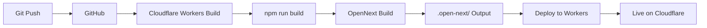

# Backend Documentation

## Table of Contents

1. [Overview](#overview)
2. [Technology Stack](#technology-stack)
3. [Architecture](#architecture)
4. [Database](#database)
5. [API Routes](#api-routes)
6. [Validation & Security](#validation--security)
7. [Internationalization](#internationalization)
8. [Configuration Files](#configuration-files)
9. [Deployment](#deployment)
10. [Development Workflow](#development-workflow)

---

## Overview

This is a Next.js 16 application deployed on Cloudflare Workers using the OpenNext adapter. The backend provides a serverless API for handling contact form submissions with internationalization support (English and Arabic).

### Key Features

- ✅ Serverless architecture on Cloudflare Workers
- ✅ Cloudflare D1 (SQLite) database
- ✅ Drizzle ORM for type-safe database queries
- ✅ Bilingual support (English/Arabic)
- ✅ Input validation and sanitization
- ✅ Edge runtime for global low-latency
- ✅ Type-safe API with TypeScript

---

## Technology Stack

### Core Framework
- **Next.js 16.3.1** - React framework with App Router
- **React 19.2.3** - UI library
- **TypeScript 5** - Type safety

### Backend & Database
- **Cloudflare Workers** - Serverless runtime
- **Cloudflare D1** - Serverless SQLite database
- **Drizzle ORM 0.45.2** - Type-safe database ORM
- **@opennextjs/cloudflare 1.20.2** - Cloudflare adapter for Next.js

### Validation & Utilities
- **Zod 4.4.3** - Schema validation (if needed)
- **Axios 1.19.0** - HTTP client

### Internationalization
- **next-intl 4.8.3** - i18n routing and translations

### Development Tools
- **Wrangler 4.71.0** - Cloudflare CLI
- **Drizzle Kit 0.31.10** - Database migrations
- **ESLint 9** - Code linting
- **Turbopack** - Fast bundler

---

## Architecture

### High-Level Architecture

```
┌─────────────────────────────────────────────────────────────┐
│                        Client Browser                        │
│                     (en.humam.sa / ar.humam.sa)             │
└────────────────────────┬────────────────────────────────────┘
                         │
                         ▼
┌─────────────────────────────────────────────────────────────┐
│                   Cloudflare CDN/Edge                        │
│              (Global network, ~300 locations)                │
└────────────────────────┬────────────────────────────────────┘
                         │
                         ▼
┌─────────────────────────────────────────────────────────────┐
│              Cloudflare Workers (Next.js App)                │
│  ┌─────────────────────────────────────────────────────┐   │
│  │  Next.js Middleware (i18n routing)                  │   │
│  └────────────────────────┬────────────────────────────┘   │
│                            │                                 │
│  ┌────────────────────────▼────────────────────────────┐   │
│  │           API Routes (App Router)                   │   │
│  │  • /api/contact - Contact form submission          │   │
│  │  • /api/dashboard/* - Admin endpoints (future)     │   │
│  └────────────────────────┬────────────────────────────┘   │
│                            │                                 │
│  ┌────────────────────────▼────────────────────────────┐   │
│  │         Validation Layer (lib/validation.ts)        │   │
│  │  • Input sanitization                               │   │
│  │  • Type validation                                  │   │
│  │  • Business rules enforcement                       │   │
│  └────────────────────────┬────────────────────────────┘   │
│                            │                                 │
│  ┌────────────────────────▼────────────────────────────┐   │
│  │        Database Layer (db/client.ts)                │   │
│  │  • Drizzle ORM connection                           │   │
│  │  • Type-safe queries                                │   │
│  └────────────────────────┬────────────────────────────┘   │
└────────────────────────────┼────────────────────────────────┘
                             │
                             ▼
                  ┌──────────────────────┐
                  │   Cloudflare D1      │
                  │  (SQLite Database)   │
                  │   • contacts table   │
                  └──────────────────────┘
```

### Request Flow

1. **Client Request** → User submits contact form
2. **Middleware** → `next-intl` handles locale routing
3. **API Route** → `/api/contact` receives POST request
4. **Validation** → `validateContactInput()` checks data
5. **Database** → Drizzle ORM inserts into D1
6. **Response** → JSON response back to client

---

## Database

### Cloudflare D1 Database

**Database Name:** `humam-contact-db`  
**Database ID:** `588dbffc-4b97-4a5f-a95d-2d42f1b0ca6d`  
**Region:** EEUR (Eastern Europe)  
**Type:** SQLite (serverless)

### Schema (db/schema.ts)

```typescript
export const contacts = sqliteTable("contacts", {
  id: integer("id").primaryKey({ autoIncrement: true }),
  name: text("name").notNull(),
  email: text("email").notNull(),
  company: text("company"),              // Optional
  industry: text("industry"),            // Optional: enum-like
  service: text("service"),              // Optional: enum-like
  status: text("status").notNull().default("new"), // new | read | replied
  message: text("message").notNull(),
  createdAt: text("created_at").notNull().default(sql`CURRENT_TIMESTAMP`),
});
```

### Table: `contacts`

| Column      | Type    | Constraints           | Description                               |
|-------------|---------|-----------------------|-------------------------------------------|
| `id`        | INTEGER | PRIMARY KEY, AUTO INC | Unique contact ID                         |
| `name`      | TEXT    | NOT NULL              | Contact person's name                     |
| `email`     | TEXT    | NOT NULL              | Contact email address                     |
| `company`   | TEXT    | NULL                  | Company name (optional)                   |
| `industry`  | TEXT    | NULL                  | Industry type (enum-like)                 |
| `service`   | TEXT    | NULL                  | Service interested in (enum-like)         |
| `status`    | TEXT    | NOT NULL, DEFAULT 'new' | Status: `new` \| `read` \| `replied`    |
| `message`   | TEXT    | NOT NULL              | Contact message content                   |
| `created_at`| TEXT    | NOT NULL, TIMESTAMP   | ISO timestamp of creation                 |

### Valid Industry Values

```typescript
'restaurants' | 'bakeries' | 'factories' | 'hotels' | 'hajj' | 'healthy'
```

### Valid Service Values

```typescript
'consultancy' | 'quality' | 'training'
```

### Database Client (db/client.ts)

```typescript
export function getDb() {
  const { env } = getCloudflareContext();
  return drizzle(env.DB);
}
```

**Key Points:**
- Uses `getCloudflareContext()` from OpenNext Cloudflare
- Returns Drizzle ORM instance with D1 binding
- Type-safe database operations
- Works in both development (remote) and production

### Migrations

Location: `db/migrations/`

**Current Migration:**
- `0000_pale_meggan.sql` - Initial contacts table creation

**Running Migrations:**

```bash
# Production (remote)
npx wrangler d1 migrations apply humam-contact-db

# Local development
npx wrangler d1 migrations apply humam-contact-db --local
```

**Creating New Migrations:**

```bash
# 1. Update schema in db/schema.ts
# 2. Generate migration
npx drizzle-kit generate

# 3. Apply migration
npx wrangler d1 migrations apply humam-contact-db
```

---

## API Routes

### POST /api/contact

Submit a contact form.

#### Endpoint

```
POST /api/contact
Content-Type: application/json
```

#### Request Body

```typescript
{
  name: string;        // Required, min 2 chars
  email: string;       // Required, valid email format
  message: string;     // Required, min 5 chars
  company?: string;    // Optional
  industry?: string;   // Optional, must be valid enum value
  service?: string;    // Optional, must be valid enum value
}
```

#### Success Response

**Status:** 201 Created

```json
{
  "success": true
}
```

#### Error Responses

**Status:** 400 Bad Request

```json
{
  "error": "Invalid input"
}
```

**Status:** 500 Internal Server Error

```json
{
  "error": "Server error message"
}
```

#### Example Usage

```javascript
const response = await fetch('/api/contact', {
  method: 'POST',
  headers: { 'Content-Type': 'application/json' },
  body: JSON.stringify({
    name: 'Ahmed Ali',
    email: 'ahmed@example.com',
    company: 'Al-Noor Restaurant',
    industry: 'restaurants',
    service: 'consultancy',
    message: 'We need HACCP certification assistance'
  })
});

const data = await response.json();
// { success: true }
```

#### Implementation (app/api/contact/route.ts)

```typescript
export async function POST(req: Request) {
  const body = await req.json().catch(() => null);
  const data = validateContactInput(body);

  if (!data) {
    return Response.json({ error: "Invalid input" }, { status: 400 });
  }

  const db = getDb();
  await db.insert(contacts).values(data);

  return Response.json({ success: true }, { status: 201 });
}
```

### Future API Routes

The `app/api/dashboard/` directory is prepared for future admin endpoints:

- `GET /api/dashboard/contacts` - List all contacts
- `GET /api/dashboard/contacts/:id` - Get single contact
- `PATCH /api/dashboard/contacts/:id` - Update contact status
- `DELETE /api/dashboard/contacts/:id` - Delete contact
- `GET /api/dashboard/stats` - Dashboard statistics

---

## Validation & Security

### Input Validation (lib/validation.ts)

The `validateContactInput()` function provides comprehensive validation:

```typescript
export function validateContactInput(data: unknown): ValidatedContactInput | null
```

#### Validation Rules

1. **Type Safety**
   - Checks if input is object
   - Validates each field type

2. **Required Fields**
   ```typescript
   name: min 2 characters, trimmed
   email: valid email regex (^\S+@\S+\.\S+$)
   message: min 5 characters, trimmed
   ```

3. **Optional Fields**
   ```typescript
   company: string or null, trimmed if provided
   industry: must be one of VALID_INDUSTRIES or null
   service: must be one of VALID_SERVICES or null
   ```

4. **Returns**
   - `ValidatedContactInput` object if valid
   - `null` if any validation fails

#### Security Features

✅ **Input Sanitization:** All strings are trimmed  
✅ **Type Validation:** Strict type checking  
✅ **Enum Validation:** Industry/service values restricted  
✅ **Length Limits:** Minimum lengths enforced  
✅ **Email Validation:** Regex pattern matching  
✅ **SQL Injection Prevention:** Drizzle ORM parameterized queries  
✅ **XSS Prevention:** No HTML rendering of user input  

### Additional Security Measures

1. **Cloudflare WAF** - Built-in DDoS protection
2. **Rate Limiting** - Available via Cloudflare (not yet configured)
3. **CORS** - Configured via Next.js middleware
4. **HTTPS Only** - Enforced by Cloudflare

---

## Internationalization

### Supported Locales

- **English (en)** - Default locale
- **Arabic (ar)** - RTL support

### Configuration (i18n/routing.ts)

```typescript
export const routing = defineRouting({
  locales: ['en', 'ar'],
  defaultLocale: 'en'
});
```

### Middleware (middleware.ts)

```typescript
export default createMiddleware(routing);

export const config = {
  matcher: ['/', '/(ar|en)/:path*']
};
```

### URL Structure

```
https://humam.sa/en/contact      → English contact page
https://humam.sa/ar/contact      → Arabic contact page
https://humam.sa/en/api/contact  → API endpoint (works with both locales)
```

### Translation Files

- `messages/en.json` - English translations
- `messages/ar.json` - Arabic translations

### Using Translations in API

```typescript
import { useTranslations } from 'next-intl';

const t = useTranslations('Contact');
const title = t('title'); // Gets translated text
```

---

## Configuration Files

### 1. next.config.mjs

**Purpose:** Next.js configuration with OpenNext Cloudflare initialization

```javascript
import { initOpenNextCloudflareForDev } from "@opennextjs/cloudflare";

await initOpenNextCloudflareForDev();

const nextConfig = {
  output: "standalone",
  experimental: {
    typedRoutes: true,
    webpackBuildWorker: false,
    inlineCss: false
  }
};
```

**Key Settings:**
- `output: "standalone"` - Required for OpenNext
- `initOpenNextCloudflareForDev()` - Enables D1 access in dev
- `await` - Ensures initialization completes

### 2. wrangler.jsonc

**Purpose:** Cloudflare Workers configuration

```jsonc
{
  "name": "humam-website",
  "compatibility_date": "2026-03-01",
  "compatibility_flags": ["nodejs_compat"],
  
  "d1_databases": [{
    "binding": "DB",
    "database_name": "humam-contact-db",
    "database_id": "588dbffc-4b97-4a5f-a95d-2d42f1b0ca6d",
    "migrations_dir": "db/migrations",
    "remote": true  // Use remote database in dev
  }],

  "assets": {
    "directory": ".open-next/assets",
    "binding": "ASSETS"
  }
}
```

**Important:** `"remote": true` enables remote D1 access during local development.

### 3. drizzle.config.ts

**Purpose:** Drizzle ORM configuration for migrations

```typescript
export default defineConfig({
  schema: "./db/schema.ts",
  out: "./db/migrations",
  dialect: "sqlite",
  driver: "d1-http",
  dbCredentials: {
    accountId: process.env.CLOUDFLARE_ACCOUNT_ID!,
    databaseId: process.env.CLOUDFLARE_DATABASE_ID!,
    token: process.env.CLOUDFLARE_D1_TOKEN!,
  },
});
```

**Environment Variables Required:**
- `CLOUDFLARE_ACCOUNT_ID`
- `CLOUDFLARE_DATABASE_ID`
- `CLOUDFLARE_D1_TOKEN`

### 4. open-next.config.ts

**Purpose:** OpenNext Cloudflare adapter configuration

```typescript
export default defineCloudflareConfig({
  // Optional: Enable R2 caching for better performance
  // incrementalCache: r2IncrementalCache
});
```

### 5. cloudflare-env.d.ts

**Purpose:** TypeScript types for Cloudflare bindings

```typescript
declare global {
  interface CloudflareEnv {
    DB: D1Database;
  }
}
```

This provides TypeScript autocomplete for `env.DB`.

### 6. tsconfig.json

**Purpose:** TypeScript compiler configuration

```json
{
  "compilerOptions": {
    "target": "ES2022",
    "lib": ["ES2022"],
    "types": ["@cloudflare/workers-types"]
  }
}
```

### 7. .dev.vars

**Purpose:** Local development environment variables (not committed to git)

```bash
# Example structure (create your own)
CLOUDFLARE_ACCOUNT_ID=your-account-id
CLOUDFLARE_DATABASE_ID=588dbffc-4b97-4a5f-a95d-2d42f1b0ca6d
CLOUDFLARE_D1_TOKEN=your-token
```

---

## Deployment

### Production Deployment to Cloudflare

#### Option 1: CLI Deployment

```bash
# Build and deploy
npm run deploy

# Or build and upload (for gradual deployments)
npm run upload
```

#### Option 2: Cloudflare Workers Builds (CI/CD)

**Recommended for production** - Automated deployment from GitHub.

1. **Connect GitHub Repository:**
   - Go to Cloudflare Dashboard → Workers & Pages
   - Connect your GitHub repository

2. **Configure Build Settings:**
   ```
   Build command: npx @opennextjs/cloudflare build
   Deploy command: npx @opennextjs/cloudflare deploy
   ```

3. **Set Environment Variables:**
   - Add production environment variables in Cloudflare Dashboard
   - Workers & Pages → Settings → Environment Variables

4. **Automatic Deployments:**
   - Push to `main` branch triggers deployment
   - Preview deployments for pull requests

### Deployment Process



### Post-Deployment

1. **Verify Deployment:**
   ```bash
   curl https://humam.sa/api/contact -X POST \
     -H "Content-Type: application/json" \
     -d '{"name":"Test","email":"test@example.com","message":"Hello"}'
   ```

2. **Check Database:**
   ```bash
   npx wrangler d1 execute humam-contact-db \
     --command "SELECT COUNT(*) FROM contacts"
   ```

3. **Monitor Logs:**
   - Cloudflare Dashboard → Workers & Pages → Logs
   - Real-time request logs and errors

### Rollback

```bash
# Via Cloudflare Dashboard
Workers & Pages → Deployments → Select previous version → Rollback
```

---

## Development Workflow

### Initial Setup

```bash
# 1. Clone repository
git clone <repo-url>
cd humam-server

# 2. Install dependencies
npm install

# 3. Authenticate with Cloudflare
npx wrangler login

# 4. Create .dev.vars file (if needed)
cp .env.example .dev.vars
# Edit .dev.vars with your credentials

# 5. Run database migrations
npx wrangler d1 migrations apply humam-contact-db

# 6. Start development server
npm run dev
```

### Development Server

```bash
npm run dev
```

**Features:**
- ✅ Hot Module Replacement (HMR)
- ✅ Turbopack for fast builds
- ✅ Remote D1 database access
- ✅ TypeScript type checking
- ✅ ESLint on save
- ✅ i18n routing

**Server Output:**
```
▲ Next.js 16.3.1 (Turbopack)
- Local:   http://localhost:3000
⎔ Establishing remote connection...
Using secrets defined in .dev.vars
✓ Running next.config.mjs took 10.5s
✓ Ready
```

### Testing API Locally

```bash
# Test contact form submission
curl -X POST http://localhost:3000/api/contact \
  -H "Content-Type: application/json" \
  -d '{
    "name": "Test User",
    "email": "test@example.com",
    "company": "Test Co",
    "industry": "restaurants",
    "service": "consultancy",
    "message": "This is a test message"
  }'

# Expected response:
# {"success":true}
```

### Database Operations

```bash
# Query database
npx wrangler d1 execute humam-contact-db --remote \
  --command "SELECT * FROM contacts ORDER BY created_at DESC LIMIT 5"

# Get database info
npx wrangler d1 info humam-contact-db

# Export data
npx wrangler d1 execute humam-contact-db --remote \
  --command "SELECT * FROM contacts" --json > backup.json
```

### Generating Migrations

```bash
# 1. Modify db/schema.ts
# 2. Generate migration SQL
npx drizzle-kit generate

# 3. Review migration in db/migrations/
# 4. Apply to production
npx wrangler d1 migrations apply humam-contact-db

# 5. Apply to local (if using local dev)
npx wrangler d1 migrations apply humam-contact-db --local
```

### Building for Production

```bash
# Build with OpenNext
npm run build

# Preview production build locally
npm run preview
```

### Code Quality

```bash
# Run linter
npm run lint

# Type checking (automatic in dev mode)
npx tsc --noEmit
```

### Common Development Tasks

#### Add a New API Route

1. Create file: `app/api/your-route/route.ts`
2. Define handler:
   ```typescript
   export async function GET(req: Request) {
     const db = getDb();
     // Your logic
     return Response.json({ data });
   }
   ```
3. Test locally: `curl http://localhost:3000/api/your-route`

#### Add a Database Table

1. Update `db/schema.ts`:
   ```typescript
   export const newTable = sqliteTable("new_table", {
     id: integer("id").primaryKey({ autoIncrement: true }),
     // ... columns
   });
   ```
2. Generate migration: `npx drizzle-kit generate`
3. Apply: `npx wrangler d1 migrations apply humam-contact-db`

#### Update Validation Rules

1. Edit `lib/validation.ts`
2. Update validation function
3. Add tests
4. Deploy

---

## Environment Variables

### Production Environment Variables

Set these in Cloudflare Dashboard → Workers & Pages → Settings → Variables:

| Variable                    | Description                           | Required |
|-----------------------------|---------------------------------------|----------|
| `CLOUDFLARE_ACCOUNT_ID`     | Cloudflare account ID                 | Yes      |
| `CLOUDFLARE_DATABASE_ID`    | D1 database ID                        | Yes      |
| `CLOUDFLARE_D1_TOKEN`       | D1 API token for migrations           | Yes      |
| `NEXT_PUBLIC_GA_TRACKING_ID`| Google Analytics tracking ID          | No       |
| `NODE_ENV`                  | `production` or `development`         | Yes      |

### Local Development Variables

Create `.dev.vars` (not committed):

```bash
CLOUDFLARE_ACCOUNT_ID=6639bbf382a99acffe0db0b9e238cc54
CLOUDFLARE_DATABASE_ID=588dbffc-4b97-4a5f-a95d-2d42f1b0ca6d
CLOUDFLARE_D1_TOKEN=your-token-here
```

---

## Troubleshooting

### Common Issues

#### 1. `getCloudflareContext` Error

**Error:**
```
ERROR: getCloudflareContext has been called without having called initOpenNextCloudflareForDev
```

**Solution:**
- Ensure `next.config.mjs` exists (not `.ts`)
- Check `await initOpenNextCloudflareForDev()` is called
- Restart dev server: `npm run dev`

#### 2. Database Connection Failed

**Error:** Can't connect to D1

**Solution:**
```bash
# Check authentication
npx wrangler whoami

# Re-login if needed
npx wrangler login

# Verify database access
npx wrangler d1 info humam-contact-db
```

#### 3. Validation Always Fails

**Check:**
- Request Content-Type header is `application/json`
- Field names match exactly (case-sensitive)
- Industry/service values are in valid enum
- Name >= 2 chars, message >= 5 chars

#### 4. Build Fails

**Solution:**
```bash
# Clear caches
rm -rf .next .open-next node_modules
npm install
npm run build
```

---

## Performance Optimization

### Current Performance

- **Cold start:** ~100-200ms (Cloudflare Workers)
- **Warm request:** ~10-50ms
- **Database query:** ~20-50ms (D1 global)
- **Global latency:** <100ms (Cloudflare Edge)

### Optimization Tips

1. **Enable R2 Caching** (optional):
   ```typescript
   // open-next.config.ts
   import r2IncrementalCache from "@opennextjs/cloudflare/overrides/incremental-cache/r2-incremental-cache";
   
   export default defineCloudflareConfig({
     incrementalCache: r2IncrementalCache
   });
   ```

2. **Add Database Indexes** (if querying frequently):
   ```sql
   CREATE INDEX idx_contacts_created_at ON contacts(created_at);
   CREATE INDEX idx_contacts_status ON contacts(status);
   ```

3. **Implement Rate Limiting:**
   - Use Cloudflare Rate Limiting rules
   - Or implement in-worker rate limiting

---

## Monitoring & Observability

### Cloudflare Analytics

- Dashboard → Workers & Pages → Analytics
- Request volume, error rate, latency

### Database Monitoring

```bash
# Recent activity
npx wrangler d1 info humam-contact-db

# Check table size
npx wrangler d1 execute humam-contact-db --remote \
  --command "SELECT COUNT(*) as total_contacts FROM contacts"
```

### Logging

Add structured logging:

```typescript
console.log({
  timestamp: new Date().toISOString(),
  event: 'contact_form_submission',
  data: { name, email }
});
```

View logs in Cloudflare Dashboard → Logs → Real-time Logs.

---

## Security Best Practices

✅ **Implemented:**
- Input validation & sanitization
- Type-safe database queries (SQL injection prevention)
- HTTPS enforced
- Cloudflare DDoS protection
- No sensitive data in client-side code

🔄 **Recommended (Future):**
- Rate limiting (Cloudflare Rules)
- CAPTCHA/bot protection (Cloudflare Turnstile)
- Email verification for submissions
- Admin authentication for dashboard
- CSRF protection for state-changing operations
- Content Security Policy (CSP) headers

---

## API Reference Summary

### Endpoints

| Method | Path            | Description              | Auth Required |
|--------|-----------------|--------------------------|---------------|
| POST   | /api/contact    | Submit contact form      | No            |

### Future Endpoints (Planned)

| Method | Path                     | Description              | Auth Required |
|--------|--------------------------|--------------------------|---------------|
| GET    | /api/dashboard/contacts  | List contacts            | Yes           |
| GET    | /api/dashboard/contacts/:id | Get contact details   | Yes           |
| PATCH  | /api/dashboard/contacts/:id | Update contact status | Yes           |
| DELETE | /api/dashboard/contacts/:id | Delete contact        | Yes           |
| GET    | /api/dashboard/stats     | Dashboard statistics     | Yes           |

---

## Resources

### Documentation

- [Next.js Docs](https://nextjs.org/docs)
- [OpenNext Cloudflare](https://opennext.js.org/cloudflare)
- [Cloudflare Workers](https://developers.cloudflare.com/workers/)
- [Cloudflare D1](https://developers.cloudflare.com/d1/)
- [Drizzle ORM](https://orm.drizzle.team/)
- [next-intl](https://next-intl-docs.vercel.app/)

### Support

- **Cloudflare Community:** https://community.cloudflare.com/
- **Next.js Discussions:** https://github.com/vercel/next.js/discussions
- **OpenNext Discord:** https://discord.gg/opennextjs

---

## Changelog

### v1.0.0 (Current)

- ✅ Contact form API with D1 database
- ✅ Bilingual support (English/Arabic)
- ✅ Input validation & sanitization
- ✅ Cloudflare Workers deployment
- ✅ Remote database access in development
- ✅ Type-safe database operations with Drizzle ORM

### Planned Features

- 🔄 Admin dashboard for contact management
- 🔄 Email notifications for new submissions
- 🔄 Rate limiting
- 🔄 CAPTCHA protection
- 🔄 Export contacts to CSV
- 🔄 Advanced analytics

---

## License

Proprietary - All rights reserved

---

**Last Updated:** August 19, 2026  
**Maintained by:** Humam Development Team
